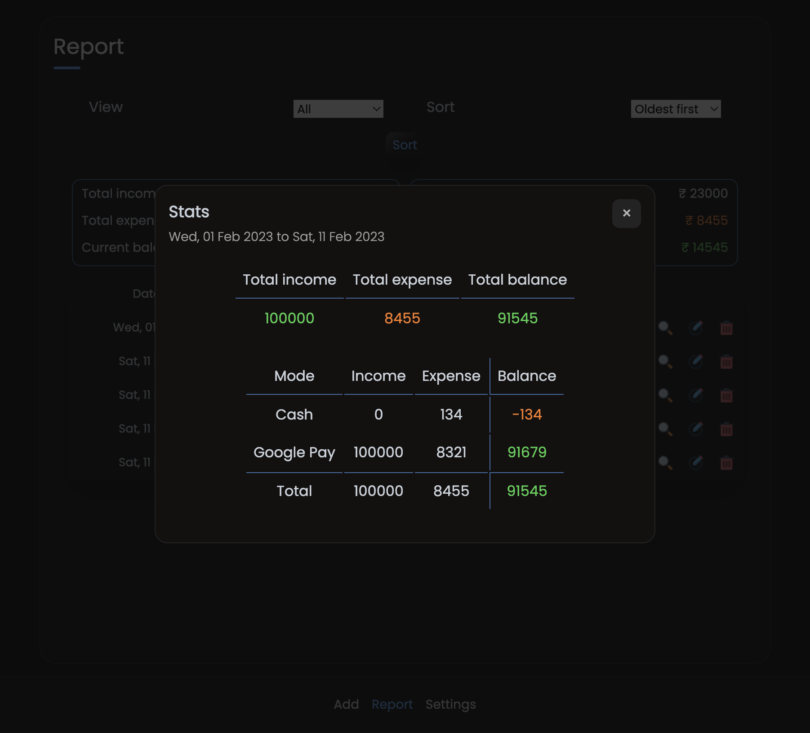

# Expense Tracker

Your very own expense tracker built in Golang

## Features

### Every transaction contains

- Date
- Description
- Amount paid
- Mode of payment
- Type of transaction
- Paid to

### App features

- Edit/Delete transaction
- Monthly budget setup
- Monthly expenditure summary
- Sort expenses with custom dates

### Report on transactions

- Shows monthly budget
- Shows spent and remaining amount
- Get monthly statistics
- Get overall statistics

## Snapshots

1. Add transactions menu

 

2. Report page

 

3. Summary/statistics

